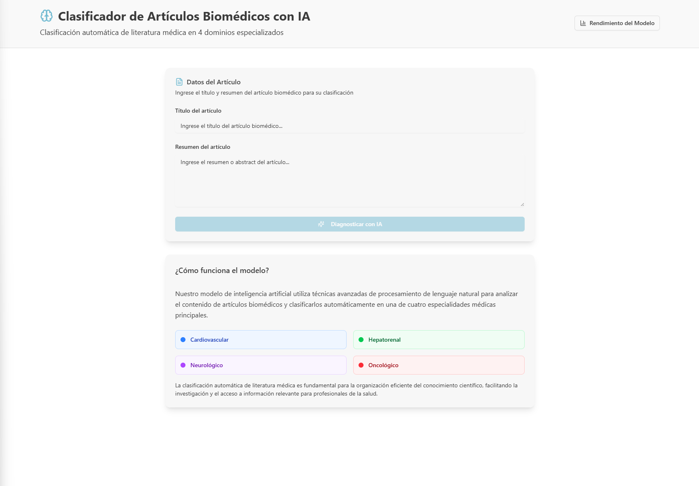
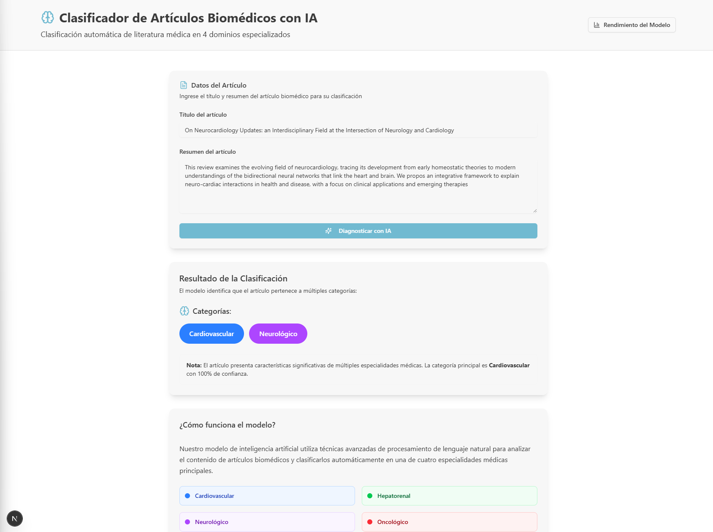
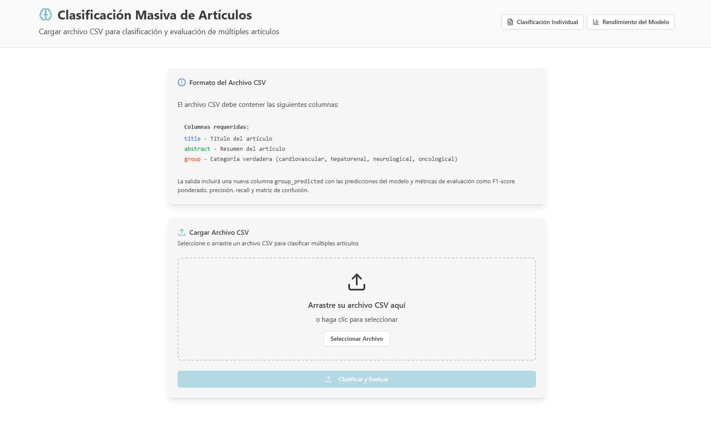

# 🧠 Clasificador de Textos Biomédicos con IA

Un sistema integral de clasificación de textos biomédicos que utiliza ImprovedMedicalBERT para categorizar literatura médica en las categorías: cardiovascular, hepatorenal, neurológica y oncológica.

## 📊 Resultados Globales

| Métrica              | Valor   |
|-----------------------|---------|
| **F1 Score Weighted** | 0.939  |
| **F1 Score Macro**    | 0.949  |
| **F1 Score Micro**    | 0.943  |

El modelo logra un **F1 Score Weighted de 0.9428**, mostrando un rendimiento muy alto y estable en un escenario de clasificación multi-etiqueta desbalanceado.

**[🚀 DEMO EN VIVO](http://159.65.106.247:3000/)**

## 🎨 Demostración Visual

La aplicación fue desarrollada utilizando **V0 (Vercel)** con prompts en lenguaje natural, permitiendo un diseño web estético y funcional:

### Página Principal - Clasificador

*Interfaz principal para clasificación de artículos biomédicos con IA*

### Resultados de Clasificación

*Visualización de resultados con categorías médicas coloreadas*

### Subir CSV

*Visualización de resultados con categorías médicas coloreadas*


## 🏗️ Estructura del Proyecto

```
Clasificacion_Biomedica/
├── 📊 data/                    # Dataset biomédico
├── 🧠 models/                  # Modelo ImprovedMedicalBERT entrenado
├── 📓 notebooks/               # Análisis Jupyter completo
├── 🔧 scripts/                 # Utilidades Python modulares + CLI
├── 🚀 backend/                 # API FastAPI + Dockerfile
├── 🌐 frontend/                # Next.js App + Dockerfile
├── 📚 docs/                    # Documentación técnica PDF
├── 🐳 docker-compose.yml       # Orquestación completa
├── 📋 requirements.txt         # Todas las dependencias
└── *.bat                       # Scripts de inicio Windows
```

## 🚀 Inicio Rápido

### Opción 1: Configuración Automatizada (Windows)
```cmd
# Clona el repositorio
git clone <repository-url>
cd Clasificacion_Biomedica

# Configuración completa
setup.bat

# Iniciar servicios (en terminales separadas)
start-backend.bat   # http://localhost:8000
start-frontend.bat  # http://localhost:3000
```

### Opción 2: Docker (Cualquier SO)
```bash
# Construir y ejecutar todos los servicios
docker-compose up --build
```

### Opción 3: CLI de Scripts
```bash
# Ver todas las opciones disponibles
python scripts --help

# Entrenar modelo desde cero
python scripts train --config configs/default.yaml

# Evaluar modelo existente
python scripts evaluate --model-path models/trained_model/
```

## 🔁 Reproducibilidad de Resultados

Este repositorio incluye todo lo necesario para **reentrenar el modelo desde cero** y obtener resultados similares a los reportados en el documento técnico.

1. Verifica que el dataset `data/challenge_data-18-ago.csv` esté disponible (ya incluido en el repositorio).
2. Ejecuta el entrenamiento con la configuración base:
   ```bash
   python scripts train --config configs/default.yaml
   ```
   > ⚠️ Nota: Los resultados exactos pueden variar ligeramente entre ejecuciones debido a factores aleatorios (semilla, inicialización de pesos, hardware).
3. Evalúa el modelo entrenado:
   ```bash
   python scripts evaluate --model-path models/trained_model/
   ```
4. Los resultados (F1 Score, Hamming Loss, métricas por clase y matrices de confusión) se generarán en la carpeta `results/` y podrán compararse con los valores reportados en [`docs/Clasificación_Biomédica.pdf`](docs/Clasificación_Biomédica.pdf).


## 🔬 Arquitectura del Modelo

### ImprovedMedicalBERT
- **Modelo Base**: microsoft/BiomedNLP-PubMedBERT-base-uncased-abstract
- **Arquitectura**: Transformer con attention pooling personalizado
- **Etiquetas**: 4 categorías médicas (clasificación multi-etiqueta)
- **Threshold optimizado**: 0.36 para mejor F1 Score
- **Entrada**: Títulos médicos + abstracts
- **Salida**: Puntuaciones de probabilidad para cada categoría

### Características Clave
- Mecanismo de attention pooling personalizado
- Regularización con dropout (0.3)
- Ponderación de clases positivas para datos desbalanceados
- Umbrales optimizados por categoría
- Soporte para aceleración GPU

## 📈 Métricas de Rendimiento

### Matriz de Confusión por Categoría

| Categoría      | Precisión | Recall | F1 Score | Soporte |
|----------------|-----------|--------|----------|---------|
| Cardiovascular | 0.95     | 0.93   | 0.94     | 157     |
| Hepatorenal    | 0.97     | 0.96   | 0.97     | 142     |
| Neurológica    | 0.94     | 0.97   | 0.95     | 165     |
| Oncológica     | 0.93     | 0.94   | 0.94     | 159     |

### Métricas Globales
- **F1 Score Macro**: 0.949
- **F1 Score Micro**: 0.943  
- **F1 Score Weighted**: 0.943
- **Hamming Loss**: 0.057
- **Exact Match Ratio**: 0.887

## 🛠️ API Endpoints

### Verificación de Salud
```bash
curl http://localhost:8000/health
```

### Clasificación Individual
```bash
curl -X POST "http://localhost:8000/classify" \
  -H "Content-Type: application/json" \
  -d '{
    "title": "Infarto agudo de miocardio",
    "abstract": "Estudio sobre factores de riesgo cardiovascular..."
  }'
```

## 📚 Documentación

📄 Documentación técnica detallada disponible en [`docs/Clasificación_Biomédica.pdf`](docs/Clasificación_Biomédica.pdf)

## 📄 Licencia

Este proyecto está licenciado bajo la Licencia MIT - ver el archivo LICENSE para detalles.

---
